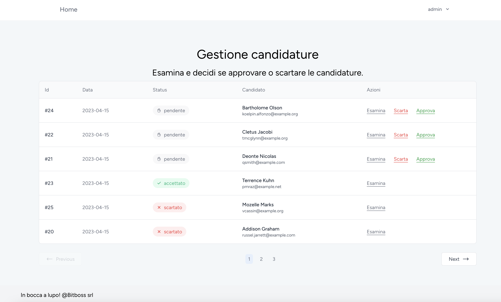
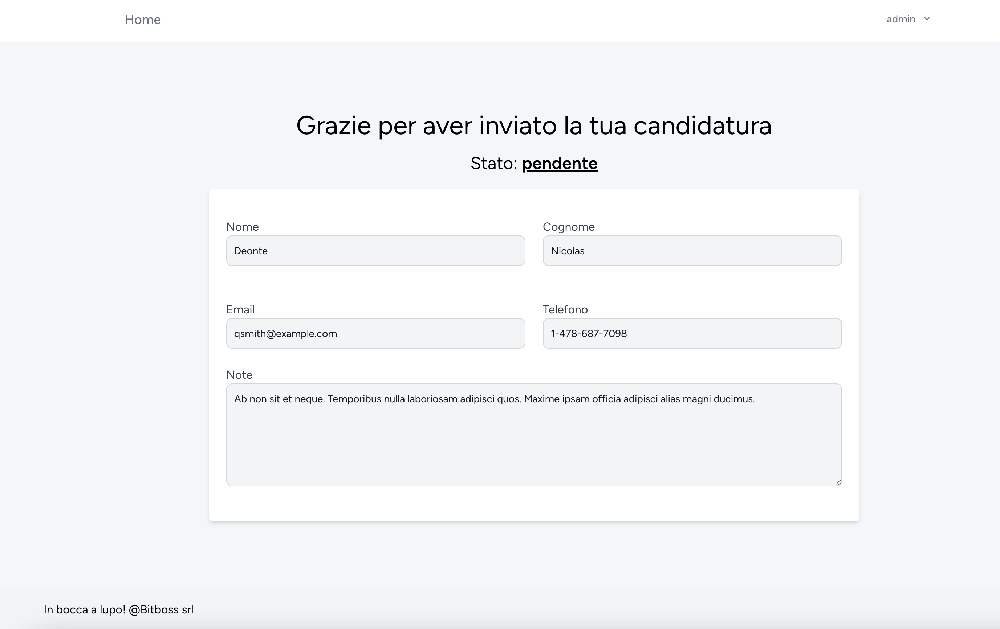
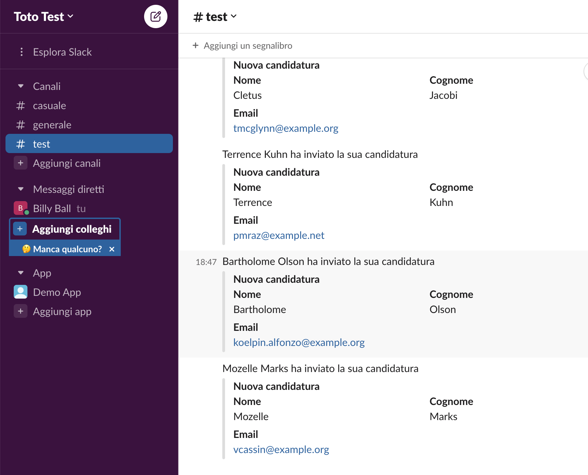
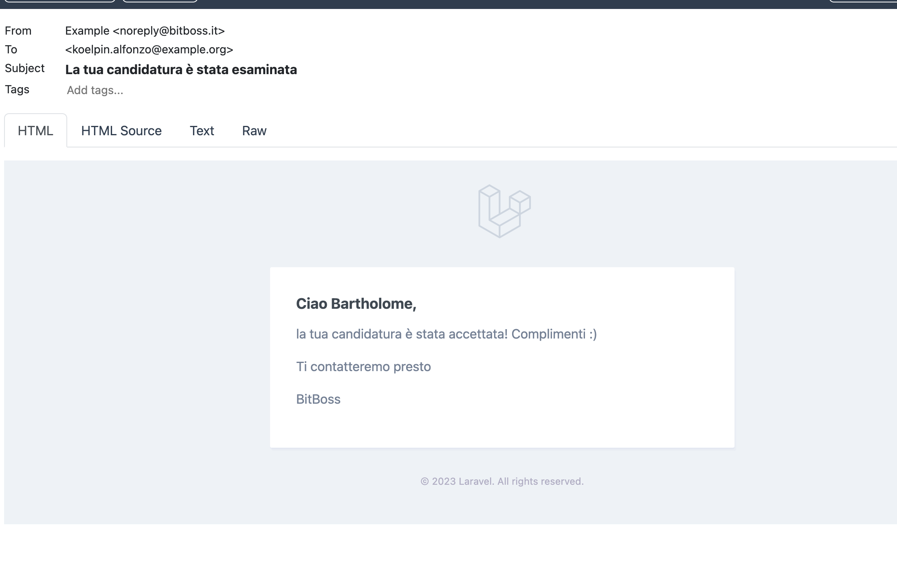

## Introduzione
Questo progetto ha avuto lo scopo di soddisfare alcuni requisiti richiesti per un colloquio di lavoro, estendendo un'applicazione preesistente. L'obiettivo dell'applicazione è quello di consentire ad un'azienda di ricevere candidature per le posizioni lavorative aperte.

Requisiti soddisfatti:
- [x] Dopo la registrazione, l'utente deve finire sulla pagina per candidarsi.
- [x] Memorizzare la candidatura dell'utente
- [x] Associare la candidatura all'utente che l'ha inviata
- [x] Dare all'utente la possibilità di accedere ad una pagina dove è presente lo stato della sua candidatura (accettata o rifiutata).Al login l'utente viene portato automaticamente su questa pagina.
- [x] Un utente non può candidarsi più volte
- [x] Solo gli utenti admin possono accedere alla manipolazione delle candidature
- [x] Logica di accettazione o scarto dopo che admin ha cliccato sul pulsante
- [x] Popolare il database con un seed delle candidature
- [x] Notifica al candidato quando viene accettato o rifiutato
- [x] Notifica quando c’è una nuova candidatura (su Slack + Email agli utenti admin)

Alcune aggiunte sviluppate in autonomia:
- [x] progetto convertito da Laravel 7 a Laravel 10
- [x] integrato startkit [breeze & Vue js](https://laravel.com/docs/10.x/starter-kits)
- [x] utilizzo di [Inertia/Vue.Js](https://inertiajs.com/) invece di un classico approccio api 


ACCOUNT DEMO AMMINISTRATORE (una volta lanciato il seed)
```
admin@bitboss.it
password
```
## Installazione

Per iniziare a utilizzare il progetto Laravel, seguire i seguenti passaggi:

1. Copiare il file `.env.example` e rinominarlo in `.env` tramite il comando:

    ```
    cp .env.example .env
    ```

2. Se vuoi puoi lanciare eseguire il progetto utilizzando sail.
3. In tal caso è  necessario avere Docker installato e configurare l'alias del comando sail seguendo la [documentazione ufficiale di Laravel](https://laravel.com/docs/10.x/sail#configuring-a-shell-alias).
4. Avviare il server
   con il comando:

    ```
    sail up -d
    ```
5. Entra nella shell di container del webserver

    ```
    sail shell
    ```

6. Effettuare la prima configurazione del progetto eseguendo i seguenti comandi:

    ```
    composer install
    npm install
    php artisan key:generate
    php artisan migrate --seed
    ```

7. Accedere al sito web aprendo il browser e digitando l'indirizzo:

    ```
    http://localhost
    ```

8. Potrai accedere alla dashboard di Mailpit tramite il link:

    ```
    http://localhost:8025
    ```

ACCOUNT DEMO AMMINISTRATORE 
```
admin@bitboss.it
password
```

## Configurare le variabili d'ambiente

Per ricevere le notifiche delle nuove candidature su Slack, è necessario aprire il file `.env` e inserire il webhook di
Slack nel parametro `SLACK_WEBHOOK`, come segue:

```
SLACK_WEBHOOK=YOUR_WEBHOOK_SLACK
```

## Screenshot del progetto


*dashboard per gestire le candidature*


*form per invio candidatura*


*notifica slack ricezione candidatura*


*notifica email al candidato risultato candidatura*